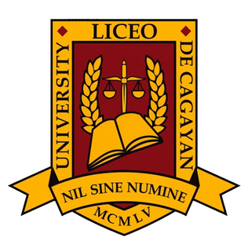

# LDCU SoilMoisture Detection System

  
  

    <strong>A high-end, real-time IoT dashboard for soil moisture monitoring and smart irrigation.</strong>
  

---

## 🚀 Overview

The **LCDU Soil Moisture Detection System** is a professional-grade IoT monitoring solution designed to provide real-time insights into soil conditions. Built with a premium "Glassmorphism" aesthetic, it offers a seamless experience for farmers, gardeners, and researchers to track soil health from anywhere in the world.

---

## Tech Stack

- **Frontend:** React 19, TypeScript, Vite
- **Styling:** Tailwind CSS (Modern Glassmorphism)
- **Animations:** Motion (formerly Framer Motion)
- **Backend/Auth:** Supabase
- **Data Source:** Google Sheets API (via CSV publishing)
---

## 🔒 Privacy & Security

We take your data seriously. The Liceo system features:

- **Encrypted Authentication** via Supabase.
- **Sanitized Data Handling** for all incoming sensor readings.
- **Publicly Auditable** code for transparency.

---

  
Built with ❤️ for the Agricultural Community

  

